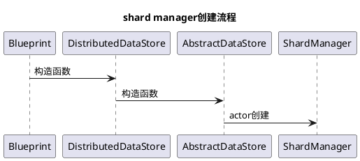
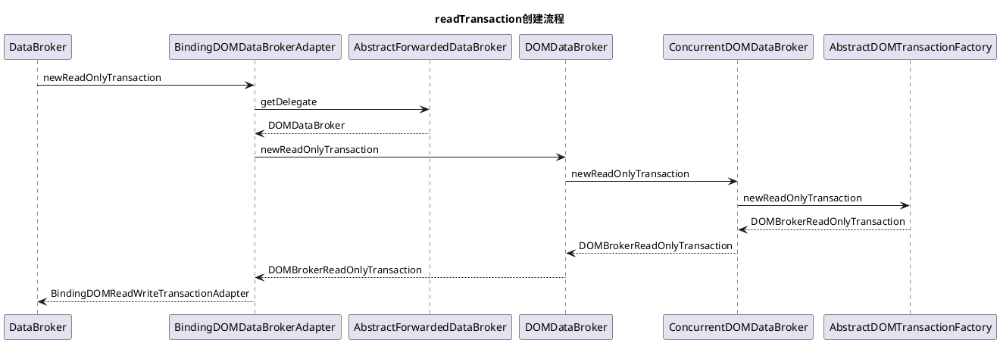
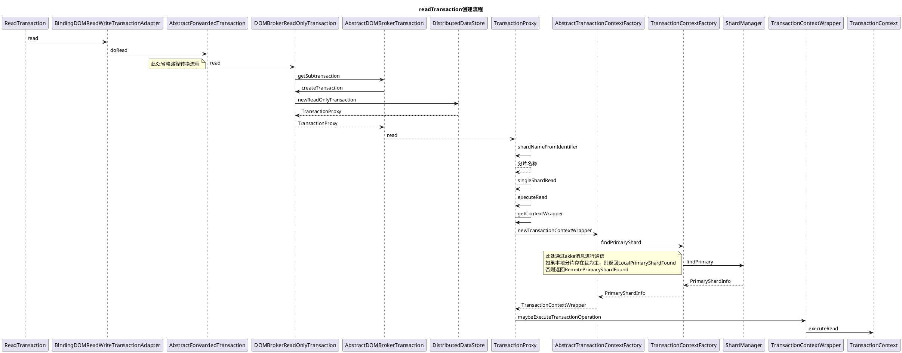

## 1. 官方介绍

[官方介绍网址](https://wiki.opendaylight.org/view/OpenDaylight_Controller:MD-SAL:Architecture:DOM_DataStore#In-Memory_Datastore_.2F_Cache)

## 2. 术语

| 属于                                | 解释                                                                                                       |
| ----------------------------------- | ---------------------------------------------------------------------------------------------------------- |
| Binding                             | 由 YANG Schema 生成的 Java 接口，类和约定。                                                                |
| Binding Aware                       | 绑定感知，使用了 YANG Schema 生成的数据和 API 的组件或功能。                                               |
| Binding Indepent                    | 绑定无关，使用 DOM 方式进行数据和 API 调用的组件或功能，它独立于由 YANG 生成的 Java 语言绑定。             |
| Binding-independent type identifier | 类似 QName 的格式的数据结构或 RPC 方法的标识符                                                             |
| Consumer                            | 使用由另一个提供者提供的模型和/或 API 的组件（例如应用程序）。                                             |
| Data operation                      | 描述整个系统状态（配置，运行数据）的数据子集之上的操作。                                                   |
| DTO                                 | 数据传输对象(Data Transfer Object)：用于在 Binding-Aware 组件之间传输数据的简单对象。 DTO 是绑定的一部分。 |
| Infrastructure Component            | 既不是提供者也不是消费者，但暴露或扩展 SAL 功能的组件                                                      |
| Provider                            | 通过特定于模型的 API 或以独立于绑定的格式为应用程序提供功能的组件                                          |
| SAL                                 | 服务抽象层                                                                                                 |
| NSF                                 | 网络服务功能（例如 TopologyManager，ForwardingRulesManager）                                               |

## 3. 数据读写流程分析

### 3.1. dataBroker 服务获取

在实际使用过程中，我们常使用以下方式获取 databroker 的服务。

```xml
<reference id="dataBroker" interface="org.opendaylight.controller.md.sal.binding.api.DataBroker" odl:type="default" />
```

### 3.2. dataBroker 服务创建

bundle：<strong> sal-binding-broker-impl </strong> 在启动时，通过 blueprint <strong> binding-broker.xml </strong>创建 DataBroker。 默认创建的 databroker 有两种类型，如下

1. odl type 为 default 的 databroker（常用）

```xml
 <service ref="bindingDataBroker" interface="org.opendaylight.controller.md.sal.binding.api.DataBroker"
           odl:type="default"/>
```

2. odl type 为 pingpong 的 databroker（不常用）

```xml
 <service ref="bindingPingPongDataBroker" interface="org.opendaylight.controller.md.sal.binding.api.DataBroker"
    odl:type="pingpong"/>
```

### 3.3. default dataBroker 创建详解

default dataBroker 创建的完整代码如下

```xml
   <!-- Binding DataBroker -->

   //操作domdatastore
   <reference id="domDefaultDataBroker" interface="org.opendaylight.controller.md.sal.dom.api.DOMDataBroker"
           odl:type="default"/>

   //实现binding aware到binding independent的转变
   <bean id="bindingDataBroker" class="org.opendaylight.controller.md.sal.binding.impl.BindingDOMDataBrokerAdapter">
     <argument ref="domDefaultDataBroker"/>
     <argument ref="mappingCodec"/>
   </bean>

   //服务暴露
   <service ref="bindingDataBroker" interface="org.opendaylight.controller.md.sal.binding.api.DataBroker"
           odl:type="default"/>
```

### 3.4. DOMDataBroker 服务创建

bundle：<strong> sal-distributed-datastore </strong> 在启动时，通过 blueprint <strong> clustered-datastore.xml </strong>创建 DOMDataBroker。

```xml
   <!-- Concurrent DOMDataBroker -->

   <bean id="listenableFutureExecutor" class="org.opendaylight.yangtools.util.concurrent.SpecialExecutors"
           factory-method="newBlockingBoundedCachedThreadPool">
     <argument value="${max-data-broker-future-callback-pool-size}"/>
     <argument value="${max-data-broker-future-callback-queue-size}"/>
     <argument value="CommitFutures"/>
     <argument>
     <!-- We should use a more specific class -->
       <bean factory-ref="operDatastore" factory-method="getClass"/>
     </argument>
   </bean>

   <bean id="commitStatsTracker" class="org.opendaylight.yangtools.util.DurationStatisticsTracker"
           factory-method="createConcurrent"/>

   //创建DOMDataBroker bean
   <bean id="clusteredDOMDataBroker" class="org.opendaylight.controller.cluster.databroker.ConcurrentDOMDataBroker"
           destroy-method="close">
     <argument>
       <map>
         <entry key="CONFIGURATION" value-ref="configDatastore"/>
         <entry key="OPERATIONAL" value-ref="operDatastore"/>
       </map>
     </argument>
     <argument ref="listenableFutureExecutor"/>
     <argument ref="commitStatsTracker"/>
   </bean>

   //暴露DOMDataBroker服务
   <service ref="clusteredDOMDataBroker" interface="org.opendaylight.controller.md.sal.dom.api.DOMDataBroker"
           odl:type="default"/>

```

### 3.5. datastore 创建

bundle：<strong> sal-distributed-datastore </strong> 在启动时，通过 blueprint <strong> clustered-datastore.xml </strong>创建 Datastore 并被 DOMDataBroker 持有

```xml
 <!-- Distributed Config Datastore -->
 <bean id="datastoreSnapshotRestore" class="org.opendaylight.controller.cluster.datastore.DatastoreSnapshotRestore"
         factory-method="instance">
   <argument value="./clustered-datastore-restore"/>
 </bean>

 <bean id="configDatastoreContext" class="org.opendaylight.controller.config.yang.config.distributed_datastore_provider.DistributedConfigDataStoreProviderModule"
         factory-method="newDatastoreContext" />

 <bean id="introspectorConfig" class="org.opendaylight.controller.cluster.datastore.DatastoreContextIntrospector">
   <argument ref="configDatastoreContext"/>
 </bean>

 <bean id="updaterConfig" class="org.opendaylight.controller.cluster.datastore.DatastoreContextPropertiesUpdater">
   <cm:managed-properties persistent-id="org.opendaylight.controller.cluster.datastore" update-strategy="component-managed" update-method="update"/>
   <argument ref="introspectorConfig"/>
   <argument ref="datastoreProps"/>
 </bean>

 <bean id="configDatastore" class="org.opendaylight.controller.cluster.datastore.DistributedDataStoreFactory"
         factory-method="createInstance" destroy-method="close">
   <argument ref="schemaService"/>
   <argument ref="configDatastoreContext"/>
   <argument ref="datastoreSnapshotRestore"/>
   <argument ref="actorSystemProvider"/>
   <argument ref="introspectorConfig"/>
   <argument ref="updaterConfig"/>
 </bean>

 <service ref="configDatastore" odl:type="distributed-config">
   <interfaces>
     <value>org.opendaylight.controller.cluster.datastore.DistributedDataStoreInterface</value>
   </interfaces>
 </service>

 <!-- Distributed Operational Datastore -->
 <bean id="fileModuleShardConfigProvider" class="org.opendaylight.controller.cluster.datastore.config.FileModuleShardConfigProvider">
   <argument value="./configuration/initial/module-shards.conf"/>
   <argument value="./configuration/initial/modules.conf"/>
 </bean>

 <bean id="configurationImpl" class="org.opendaylight.controller.cluster.datastore.config.ConfigurationImpl">
   <argument ref="fileModuleShardConfigProvider"/>
 </bean>

 <bean id="operDatastoreContext" class="org.opendaylight.controller.config.yang.config.distributed_datastore_provider.DistributedOperationalDataStoreProviderModule"
         factory-method="newDatastoreContext" />

 <bean id="introspectorOper" class="org.opendaylight.controller.cluster.datastore.DatastoreContextIntrospector">
   <argument ref="operDatastoreContext"/>
 </bean>

 <bean id="updaterOper" class="org.opendaylight.controller.cluster.datastore.DatastoreContextPropertiesUpdater">
   <cm:managed-properties persistent-id="org.opendaylight.controller.cluster.datastore" update-strategy="component-managed" update-method="update"/>
   <argument ref="introspectorOper"/>
   <argument ref="datastoreProps"/>
 </bean>

 <bean id="operDatastore" class="org.opendaylight.controller.cluster.datastore.DistributedDataStoreFactory"
         factory-method="createInstance" destroy-method="close">
   <argument ref="schemaService"/>
   <argument ref="operDatastoreContext"/>
   <argument ref="datastoreSnapshotRestore"/>
   <argument ref="actorSystemProvider"/>
   <argument ref="introspectorOper"/>
   <argument ref="updaterOper"/>
   <argument ref="configurationImpl" />
 </bean>

 <service ref="operDatastore" odl:type="distributed-operational">
   <interfaces>
     <value>org.opendaylight.controller.cluster.datastore.DistributedDataStoreInterface</value>
   </interfaces>
 </service>
```

### 3.6. shard manager 创建
创建datastore的同时会创建shard manager，config 和operation 数据库均对应一个shard manager，用来管理所有的分片。

<details>
<summary>shard manager创建流程</summary>


</details>

### 3.7. 数据库分片创建
#### 3.7.1. module-shards.conf中配置的分片创建
<details>
 <summary> module-shards.conf中配置的分片创建</summary>

 ```plantuml
@startuml

  title module-shards.conf中配置的分片创建

  Akka持久化机制 -> AbstractUntypedPersistentActor:onReceiveRecover
  AbstractUntypedPersistentActor -> AbstractUntypedPersistentActor:handleRecover
  AbstractUntypedPersistentActor -> ShardManager:onRecoveryCompleted
  ShardManager -> ShardManager:createLocalShards
  note left
      创建ShardInformation并存储
  end note
  ScanningSchemaServiceProvider ->ScanningSchemaServiceProvider: tryToUpdateSchemaContext
  ScanningSchemaServiceProvider ->ScanningSchemaServiceProvider: notifyListeners
  ScanningSchemaServiceProvider -> AbstractDataStore:onGlobalContextUpdated
  ScanningSchemaServiceProvider -> ActorContext:setSchemaContext
  ActorContext -> ShardManager:handleCommand
  ShardManager -> ShardManager:updateSchemaContext
  ShardManager -> ShardManager:newShardActor
@enduml
```
</details>

#### 3.7.2. prefix-configuration-shard 创建
The prefixed shard feature is intended to allow the data store to be sharded more granularly at any level in the yang tree rather than just top-level yang modules. There are cluster-admin RPCs to configure prefixed shards. However the feature should probably be considered alpha at this point and the original contributors abandoned it so no one is actively working on it.
<details>
 <summary>prefix-configuration-shard 创建</summary>

 ```plantuml
@startuml

  title module-shards.conf中配置的分片创建

  Blueprint -> DistributedShardedDOMDataTree:构造函数
  DistributedShardedDOMDataTree -> DistributedShardedDOMDataTree:createPrefixConfigShard
  DistributedShardedDOMDataTree -> ShardManager:createShardMessage(akka消息)
  ShardManager  -> ShardManager:onCreateShard
@enduml
```
</details>

#### 3.7.3. entity-ownership-operational创建
entity-ownership-operational 主要处理entity-ownership相关业务。其中entity-ownership的选主逻辑可以查看另外一篇文章entity-ownership逻辑分析
```xml 
 <!-- Distributed EntityOwnershipService -->
   <cm:cm-properties id="strategiesProps" persistent-id="org.opendaylight.controller.cluster.entity.owner.selection.strategies" />
 
   <bean id="selectionStrategyConfig" class="org.opendaylight.controller.cluster.datastore.entityownership.selectionstrategy.EntityOwnerSelectionStrategyConfigReader"
           factory-method="loadStrategyWithConfig">
     <argument ref="strategiesProps"/>
   </bean>
 
   <bean id="distributedEntityOwnershipService" class="org.opendaylight.controller.cluster.datastore.entityownership.DistributedEntityOwnershipService"
           factory-method="start" destroy-method="close">
     <argument>
       <bean factory-ref="operDatastore" factory-method="getActorContext"/>
     </argument>
     <argument ref="selectionStrategyConfig"/>
   </bean>
 
   <service ref="distributedEntityOwnershipService" interface="org.opendaylight.mdsal.eos.dom.api.DOMEntityOwnershipService"
         odl:type="default"/> 
```
创建流程如下
<details>
 <summary>entity-ownership-operational创建</summary>

 ```plantuml
@startuml

  title module-shards.conf中配置的分片创建

  Blueprint -> DistributedEntityOwnershipService:构造函数
  DistributedEntityOwnershipService -> DistributedEntityOwnershipService:executeOperationAsync
  DistributedEntityOwnershipService -> ShardManager:createShardMessage(akka消息)
  ShardManager  -> ShardManager:onCreateShard
@enduml
```

</details>

### 3.8. 数据读取流程

#### 3.8.1. read

##### 3.8.1.1. readTransaction 的创建代码通常如下：

```java
 ReadTransaction readTransaction = dataBroker.newReadOnlyTransaction();
```

##### 3.8.1.2. readTransaction 创建流程
readTransaction最终返回的是<strong> DOMBrokerReadOnlyTransaction </strong>，流程图如下：
<details>
<summary>readTransaction创建流程</summary>


BindingDOMReadWriteTransactionAdapter 是binding aware 到 binding independent的转换器。主要负责java binding 路径到 dom 路径的转换。

</details>

##### 3.8.1.3. 读取流程
数据读取实际操作总会在分片的主上进行， 若分片的主不为当前读取数据的节点，则通过akka消息触发。

<details>
<summary>数据读取</summary>



</details>

## 4. 创建的actor
odl集群采用akka进行通信，数据库也是采用akka的机制进行持久化。

```shell
  /
        system
            akka.persistence.journal.leveldb
                $a
            akka.persistence.snapshot-store.local
            cluster
                core
                    daemon
                        crossDcHeartbeatSender
                        heartbeatSender
                    publisher
                heartbeatReceiver
            clusterEventBusListener
            deadLetterListener
            endpointManager
            eventStreamUnsubscriber-1
            log1-Slf4jLogger
            recoveryPermitter
            remote-deployment-watcher
            remote-watcher
            remoting-terminator
            transports
                akkaprotocolmanager.tcp0
        user
            $a
            $b
            $c
            $d
            $e
            $f
            $g
            $h
            $i
            $j
            $k
            $l
            $m
            $n
            $o
            ShardedDOMDataTreeFrontend
            quarantined-monitor
            rpc
                broker
                registrar
                registry
                    gossiper
            shardmanager-config
                member-1-shard-default-config
                    $a
                    $b
                    $c
                    $d
                    member-1-shard-default-config-DTCL-publisher
                    member-1-shard-default-config-notifier
                    shard-member-1:snapshot-read
                member-1-shard-prefix-configuration-shard-config
                    $a
                    $b
                    member-1-shard-prefix-configuration-shard-config-DCL-publisher
                    member-1-shard-prefix-configuration-shard-config-DTCL-publisher
                    member-1-shard-prefix-configuration-shard-config-notifier
                    shard-member-1:snapshot-read
                member-1-shard-young-config
                    $a
                    member-1-shard-young-config-DTCL-publisher
                    member-1-shard-young-config-notifier
                    shard-member-1:snapshot-read
            shardmanager-operational
                member-1-shard-default-operational
                    member-1-shard-default-operational-notifier
                    shard-member-1:snapshot-read
                member-1-shard-entity-ownership-operational
                    member-1-shard-entity-ownership-operational-DTCL-publisher
                    member-1-shard-entity-ownership-operational-notifier
                    shard-member-1:snapshot-read
                member-1-shard-prefix-configuration-shard-operational
                    $a
                    $b
                    member-1-shard-prefix-configuration-shard-operational-DCL-publisher
                    member-1-shard-prefix-configuration-shard-operational-DTCL-publisher
                    member-1-shard-prefix-configuration-shard-operational-notifier
                    shard-member-1:snapshot-read
                member-1-shard-young-operational
                    member-1-shard-young-operational-notifier
                    shard-member-1:snapshot-read
            termination-monitor
opendaylight-user@root>

```

## 5. 数据库基本结构

下图为官方绘制于 2014 年，之后又少许结构调整。


[SAL Core SPI](https://git.opendaylight.org/gerrit/gitweb?p=controller.git;a=tree;f=opendaylight/md-sal/sal-dom-spi/src/main/java/org/opendaylight/controller/sal/core/spi/data;h=8df35c1df3b5f2e233c1827f41d8665374def04c;hb=e35d98a33c70782ac40e43a05864a25d1984ff33)

[SAL Core API](https://git.opendaylight.org/gerrit/gitweb?p=controller.git;a=tree;f=opendaylight/md-sal/sal-common-api/src/main/java/org/opendaylight/controller/md/sal/common/api/data;h=152ddfb4000ee1eff73668e5b8c33dc72491e799;hb=e35d98a33c70782ac40e43a05864a25d1984ff33)

## 6. 新标准化树形数据模型

对于数据的新标准化模型将代表后面的 YANG 规格的实际概念。 这将不再是基于序列化
格式（定义见 YANG 规格和使用的 SAL- 经纪参数 impl1.0 ）。

- <strong> NormalizedNode </strong>
  代表在树结构中的一个 节点的基本类型 ;所有其他节点类型是来自这个基本类型。它包
  含一个叶子识别符和一个值。
- - DataContainerNode
    其中包含 多个叶节点 ;它在 YANG 语法中没有直接表示。
- - - ContainerNode
      容器节点 ，它包含了多个子叶片和映射到 YANG 容器陈述。 （ Node, which
      represents a leaf which can occur only once per parent node; it contains multiple child
      leaves and maps to the container statement in YANG. ）
- - - MapEntryNode
      节点代表一个叶子， 叶子是唯一识别的键的值。 MapEntryNode 中可以包含多
      个。（ Node which represents a leaf, which can occur multiple times; a leave is
      uniquely identified by the value of its key. A MapEntryNode may contain
      multiple ）
- - - ChoiceNode
      节点代表一个叶子， 这大多发生一次， 每个父节点， 但可能的值可以有不同的
      类型。地图来选择语句。类型映射到该选择的 case 语句。
- - - AugmentationNode
      Node which represents a leaf, which occurs mostly once per parent node.
- - LeafNode
    叶子节点，存放相关值（ PS：官网解释是 Contains simple value. ）。
- - LeafSetEntryNode
- - LeafSetNode
- - MapNode

## 7. DOM Data Broker

提供访问概念性数据树存储方法，并提供接口对存储树的某一分支下的数据更改。
具体定义的类

执行过程
当前的 DOM 数据代理（ DOM Data Broker ）并没有设计成一个智能化的内存缓存树形
结构， 这种内存缓存树形结构能够跟踪依赖关系， 计算变更和维护提交处理程序， 通知监听
器和实现数据之间的关系假设。 这可能会导致效率低下， 执行两个阶段提交， 其中在由数据
代理本身所做的一切状态跟踪。如下所示：

1. 计算受影响的子树。
2. 过滤提交处理受影响的子树。
3. 过滤数据受影响子树的数据改变监听器。
4. 捕获初始状态数据的更改监听器。
5. 启动所有受影响的提交处理程序的提交申请。
6. 完成提交的所有受影响的提交处理程序。
7. 捕获最后的数据状态改变监听器。
8. 向受影响的数据更改监听器发布数据更改事件。

dom broker 需要保持和维护以下部分的状态

1. 将子树路径映射到已注册的提交处理程序
2. 将子树路径映射到已注册的数据会更改侦听器
3. 将子树路径映射到已注册的数据读取器

此外，dom broker 职责是：

1. 路由读取数据的请求
2. 数据两阶段提交
3. 发布数据更改事件：捕获数据更改之前的状态和数据更改之后的状态

## 8. mdsal-clustering

## 9. 数据库监听

### 9.1. 非集群监听
```java 
 DataChangeListener
 DataTreeChangeListener
 DOMDataChangeListener
 DOMDataTreeChangeListener 
```

### 9.2. 集群监听
```java 
 ClusteredDataChangeListener
 ClusteredDataTreeChangeListener
 ClusteredDOMDataChangeListener
 ClusteredDOMDataTreeChangeListener 
```