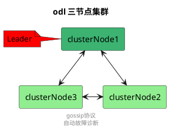
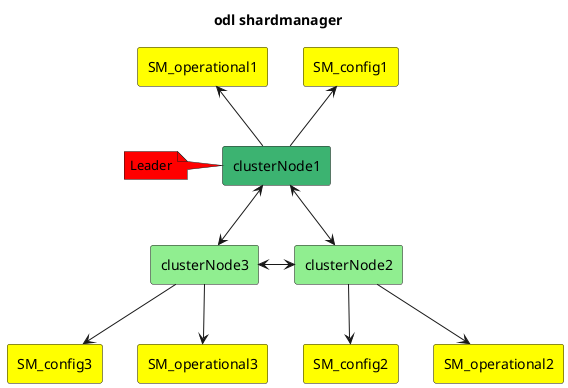
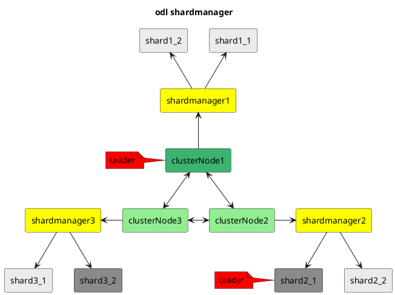
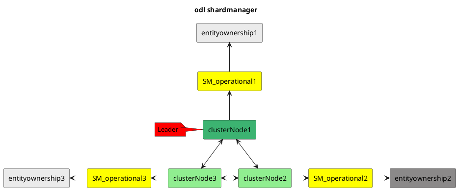

## 1. odl集群
odl的三节点集群完全依赖akka集群构建。采用gossip协议收敛，并实现集群故障自动诊断。
[akka官网集群介绍](https://doc.akka.io/docs/akka/current/common/cluster.html)

## 2. shardManager
odl的每个节点均有一个shardManager。shardManager不组成集群，其主要职责如下
1. 负责处理本节点的分片创建
2. 负责接收集群节点的状态（cluster event ，eg：MemberUp），并触发数据库分片和ownershp动作
3. 持久化分片信息（persistShardList）

# datastore shard
shardmanager会根据module-shards.conf中的配置创建shard，<strong> 如果replicas不存在A节点，则A不创建对应的shard </strong>。不通的节点的同一分片通过raft算法选出对应的leader 和 fllower。(shardmanager config 和operational 均会创建分片)

## 3. entityownership shard
entityownership shad 负责处理用户级别的选主，例如netconf和设备的链接主备。entityownership的选主有几种策略，FirstCandidateSelectionStrategy、LeastLoadedCandidateSelectionStrategy、LastCandidateSelectionStrategy。entityownership shard只存在于shard manager operational 下.entityownership shad 本身继承自shard，其选主也是通过raft算法。
