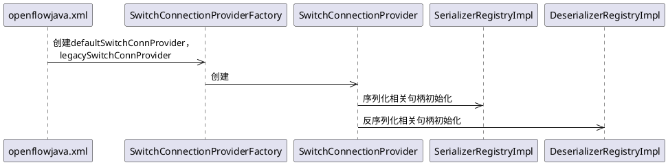
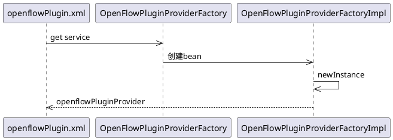
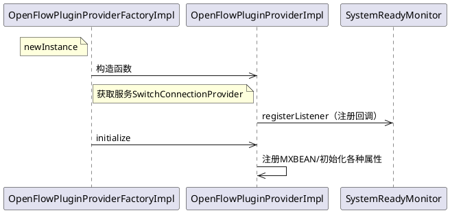
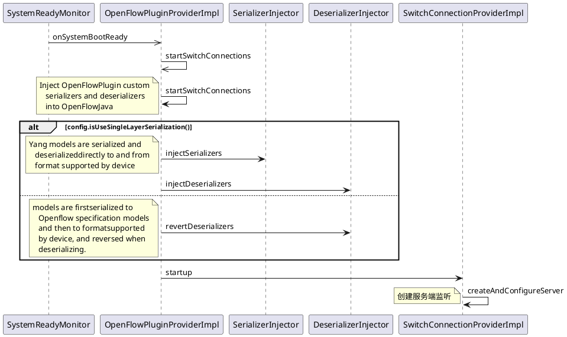

## 1. SwitchConnectionProvider 初始化

&emsp;&emsp;SwitchConnectionProvider 包含两种类型：defaultSwitchConnProvider 对应 openflow13，监听 6653 端口；legacySwitchConnProvider 对应 openflow10，监听 6633 端口。两者均会被初始化，初始化时，会创建序列化和反序列化的相关句柄。



## 2. openflowPluginProvider 创建

&emsp;&emsp;openflowPluginProvider 为 openflow 对外服务的接口入口，包含了 rpc，notification，databroker，entityOwnershipService 等关键信息。
&emsp;&emsp;defaultSwitchConnProvider，legacySwitchConnProvider 分别对应 openflow13 和 openflow10。版本不同，后续 netty pipeline 中添加的 handle 不同。

图：openflowPluginProvider 创建



具体代码如下：

```xml
<bean id="openflowPluginProvider"
    factory-ref="openflowPluginProviderFactory"
    factory-method="newInstance"
    destroy-method="close">
    <argument ref="configurationService"/>
    <argument ref="dataBroker"/>
    <argument ref="rpcRegistry"/>
    <argument ref="notificationPublishService"/>
    <argument ref="entityOwnershipService"/>
    <argument>
        <list>
            <ref component-id="defaultSwitchConnProvider"/>
            <ref component-id="legacySwitchConnProvider"/>
        </list>
    </argument>
    <argument ref="clusterSingletonServiceProvider"/>
    <argument ref="mastershipChangeServiceManager"/>
    <argument ref="ofPluginDiagstatusProvider"/>
    <argument ref="systemReadyMonitor"/>
</bean>
```

## 3. OpenFlowPluginProviderImpl 初始化

&emsp;&emsp;`OpenFlowPluginProviderFactoryImpl newInstance`中会调用`OpenFlowPluginProviderImpl`的构建函数，而`OpenFlowPluginProviderImpl`的构建函数中的`systemReadyMonitor.registerListener(this)`会监听 osgi 是否所有 bundle 已经安装，其后会回调函数`onSystemBootReady`。
&emsp;&emsp;同时`OpenFlowPluginProviderFactoryImpl newInstance`会调用`OpenFlowPluginProviderImpl;initialize`进行一些初始化工作。注意，这里注册了 MXBEAN，我们可以在外部通过 jmx 监控内部信息。
&emsp;&emsp;OpenFlowPluginProviderImpl 会通过 blueprint 获取 SwitchConnectionProvider 服务。
图：OpenFlowPluginProviderImpl 初始化



## 4. 监听创建

&emsp;&emsp;当 osgi 所有 bundle 安装完成后，框架会回调 onSystemBootReady 函数。创建服务端监听。
图：监听创建


