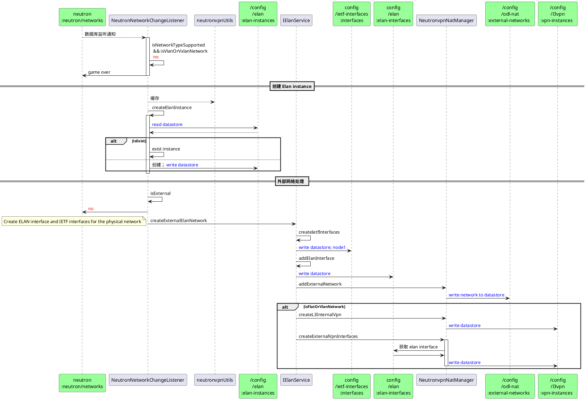
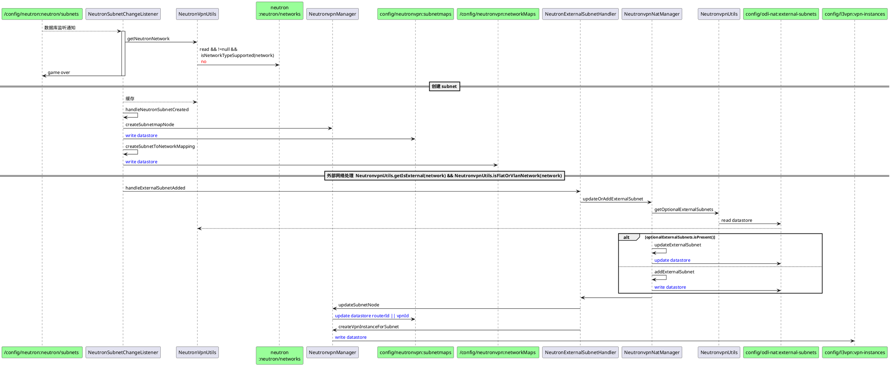

#主要功能
&emsp;监听Datastore中由neutron-northbound plugin的transcriber转换后的数据结构，再次转换为vpndervice中的数据结构，并存入datastroe。  

#主要结构
api:  
    yang: neutronvpn
impl:  


类 | 监听库 | 操作库|
---------|----------|---------
NeutronBgpvpnChangeListener|neutron:neutron/bgpvpns|
NeutronFloatingToFixedIpMappingChangeListener|
NeutronHostConfigChangeListener|
NeutronNetworkChangeListener|neutron:neutron/networks|
NeutronPortChangeListener     |
NeutronRouterChangeListener|
NeutronSecurityRuleConstants|  
NeutronSubnetChangeListener|
NeutronSubnetGwMacResolver|
NeutronTrunkChangeListener  |
UpgradeStateListener |
IPV6InternetDefaultRouteProgrammer  |
NeutronvpnManager  |
NeutronvpnManagerImpl  |
NeutronvpnNatManager  |
NeutronvpnUtils  |
NeutronExternalSubnetHandler|

# NeutronNetworkChangeListener
## add 





**node1**
```
Create ietf-interfaces based on the ELAN segment type.
    For segment type flat - create transparent interface pointing to thepatch-port attached to the physnet port.<br>
    For segment type vlan - create trunk interface pointing to the patch-portattached to the physnet port + trunk-member interface pointing to thetrunk interface.
```

**node2**
```
使用非集群监听，并通过 ConcurrentMap<Uuid, Network> 缓存数据，若A为master时，创建网络并缓存，一旦集群震荡，B切换为master，此时删除网络，则A中ConcurrentMap会产生数据残留，
不清楚是否会影响业务，但是肯定会造成内存泄漏。
是否可以使用集群监听，所有节点均对缓存进行操作，但是仅仅只有owner处理业务逻辑EntityOwnershipUtils
```

#NeutronSubnetChangeListener
##add





#NeutronRouterChangeListener
## add 
