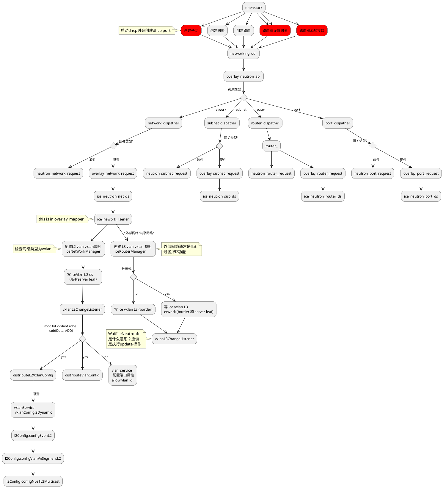

 
项目框架图

```plantuml
@startuml
  openstack --> 创建网络 
  openstack -->  创建子网 #red
  note left
      启动dhcp时会创建dhcp port
  endnote
  openstack --> 创建路由
  openstack --> 路由器设置网关 #red
  openstack --> 路由器设置网关 #red
  openstack --> 路由器添加接口 #red
  创建网络 --> networking_odl
  创建子网 --> networking_odl
  创建路由 --> networking_odl
  路由器设置网关 --> networking_odl
  路由器添加接口 --> networking_odl
  networking_odl --> overlay_neutron_api
  if “资源类型” then
      -->[network] "network_dispather"
         if 网关类型" then
             -->[软件]"neutron_network_request"
          else
             -->[硬件]"overlay_network_request"
          endif
  else
      -->[subnet]"subnet_dispather"
          if 网关类型" then
             -->[软件]"neutron_subnet_request"
          else
             -->[硬件]"overlay_subnet_request"
          endif
  else
      -->[router]"router_dispather"
             router_dispather --> "router_"
             router_ -->"neutron_router_request"
             router_-->"overlay_router_request"
  else
      -->[port]"port_dispather"
          if 网关类型" then
             -->[软件]"neutron_port_request"
          else
             -->[硬件]"overlay_port_request"
          endif
  endif
  overlay_network_request --> ice_neutron_net_ds
  overlay_subnet_request --> ice_neutron_sub_ds
  overlay_router_request --> ice_neutron_router_ds
  overlay_port_request --> ice_neutron_port_ds
  ice_neutron_net_ds --> ice_nework_lisener
  note left
      this is in overlay_mapper
  end note
  ice_nework_lisener --> "配置L2 vlan-vxlan映射 \n iceNetWorkManager"
  note left
      检查网络类型为vxlan
  end note
  --> “写 iceVlxn L2 ds \n（所有server leaf）”
  --> vxlanL2ChangeListener
  if modifyL2VxlanCache \n (addData, ADD) then
      -->[yes] distributeL2VxlanConfig
  else
      -->[yes] distributeVlanConfig
  else
      -->[no] vlan_service \n 配置端口属性\nallow vlan id 
  endif
  ice_nework_lisener --> [“外部网络/共享网络”] "创建 L3 vlan-vxlan 映射 \n iceRouterManager"
  note right
      外部网络通常是flat 
      过滤掉l2功能
  end note
  if "分布式" then
      -->[yes]"写 ice vxlan L3 \network (border 和 server leaf)"
      --> vxlanL3ChangeListener
      note left
          WaitIceNeutronId
          是什么意思？应该
          是执行update 操作
      end note
  else
      -->[no]"写 ice vxlan L3 (border)" 
      --> vxlanL3ChangeListener
  endif
  distributeL2VxlanConfig -->[硬件] vxlanService \n vxlanConfigl2Dynamic
  --> l2Config.configEvpnL2
  --> l2Config.configVlanVnSegmentL2
  --> l2Config.configNve1L2Multicast
@enduml
```

