# 网络处理

## 1. 常规步骤
### 1.1. add

***

<Strong>第一步：添加网络</Strong>

&emsp;&emsp;当北向创建网络api被调用，neutron写入config neutron/network/network库，并触发datastore监听。

* **neutronVpn/NeutronNetworkChangeListener:** 在进行一些基础检查后，创建elanInstance（一个网络对应一个elan instance）。创建elanInstance时会查询config elan-instances/elan-instance库，如果存在，则返回，如果不存在则创建enlanInstace数据，写入config库
  
   

* **ipv6Service/NeutronNetworkChangeListener:**
 
 
  
* **qosservice/QosNeutronNetworkChangeListener:**
  
 

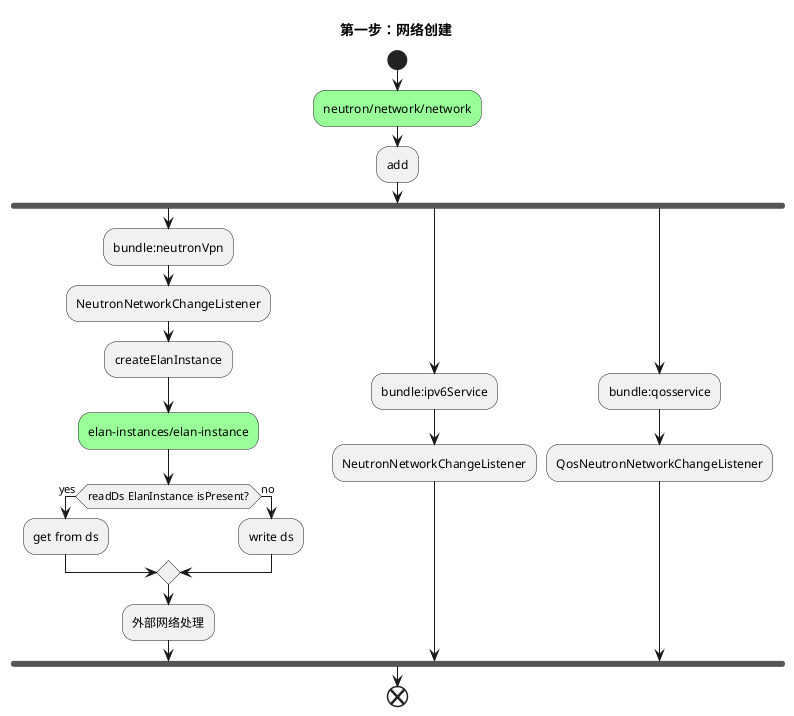

***

<Strong>第二步：创建elan</Strong>

&emsp;&emsp;当elan-instances/elan-instance config库被写入数据后，开始触发elan创建的流程。在创建elan的过程中，会写入其他的多个operational数据库，不过这些数据库都没有监听器，仅仅作为数据存储所用。
&emsp;&emsp;创建elan-instances/elan-instance时还会更新elan-instances/elan-instance config库

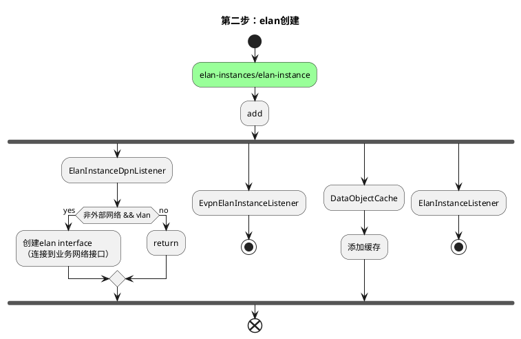

&emsp;&emsp;**接下图**

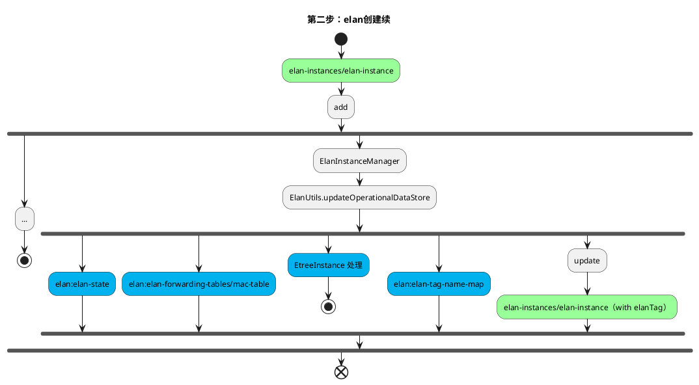

***

<Strong>第三步：elan 更新</Strong>

&emsp;&emsp;当elan-instances/elan-instance config库被更新数据后，开始触发elan更新的流程。

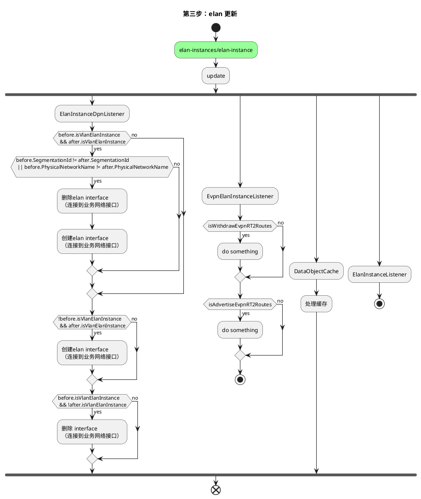

&emsp;&emsp;**接下图**

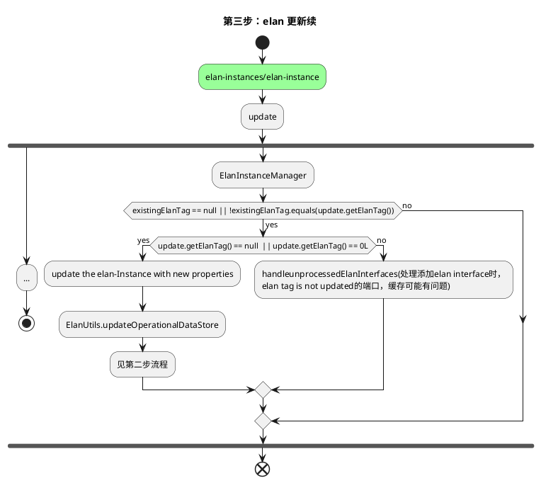

### 1.2. update

&emsp;&emsp;当北向api 更新neutron/network/network后，NeutronNetworkChangeListener不作其他操作.

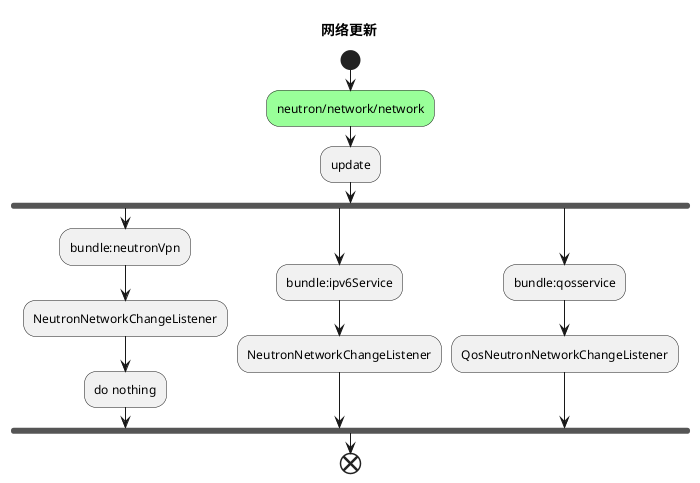

### 1.3. remove
***

<Strong>第一步：删除网络</Strong>

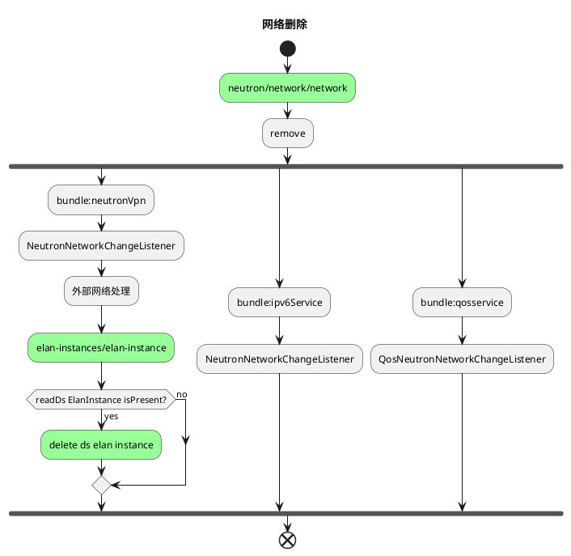
    
&emsp;&emsp;删除数据库中的elan instance数据后，触发相关的其他流程。

***

<Strong>第二步：elan删除</Strong>

## 2. vlan网络创建
&emsp;&emsp;vlan 网络创建时，会提前创建一个elan interface 到业务口的映射。（odl原生代码中没有）在软件vtep 环境下创建vlan 网络或者硬件vtep环境下创建网络（overlay会将openstack创建的vxlan网络修改为vlan网络）会被触发。

<Strong>第一步：vlan 网络创建</Strong>

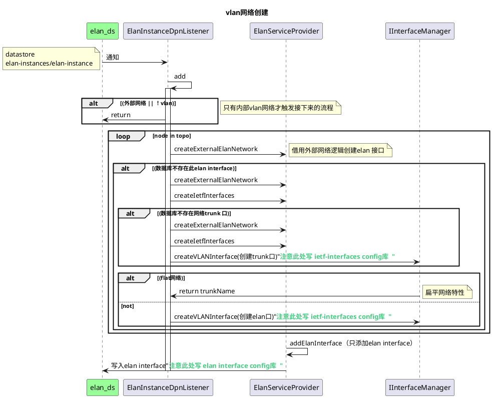

&emsp;&emsp;在上图中，有几处会写数据库的操作，因此，会触发其他监听程序。

&emsp;&emsp;上图中trunk 口可elan interface的解释如下。其中`IfmConstants.OF_URI_SEPARATOR=":"`；`parentRef = dpnid:业务口`

| 端口性质  |  名称规则 | 示例 |
|---|---|---|
| trunk   | parentRef + IfmConstants.OF_URI_SEPARATOR + "trunk"  |203100663178074:ens192:trunk|
| elan interfaced  | parentRef + IfmConstants.OF_URI_SEPARATOR + segmentationId  |62457717962162:ens192:100|

***

<Strong>第二步：ietf interface 创建</Strong>

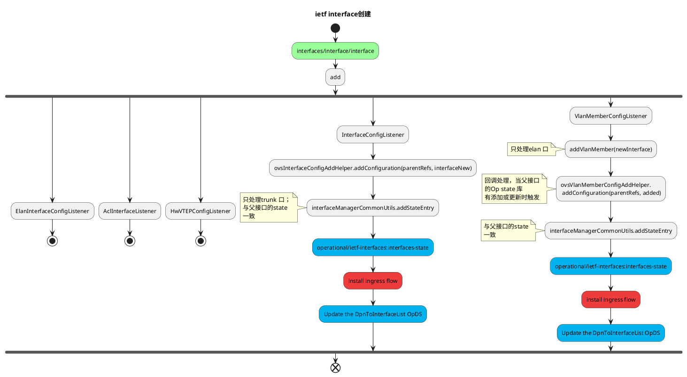

***

<Strong>第三步：elan interface 创建</Strong>

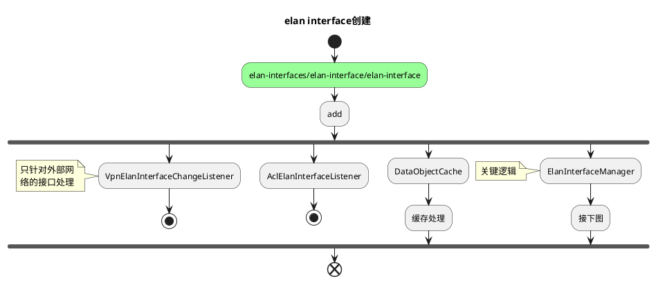

***

<Strong>第三步续：elan interface 创建</Strong>

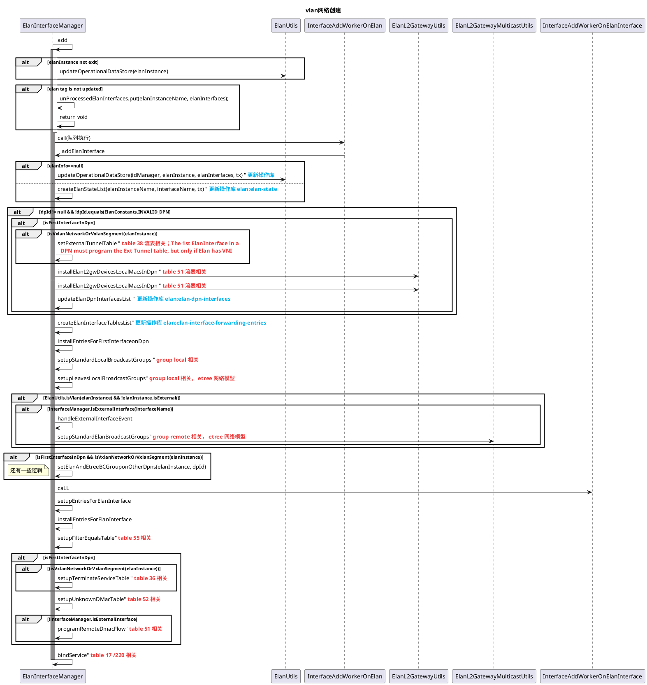

