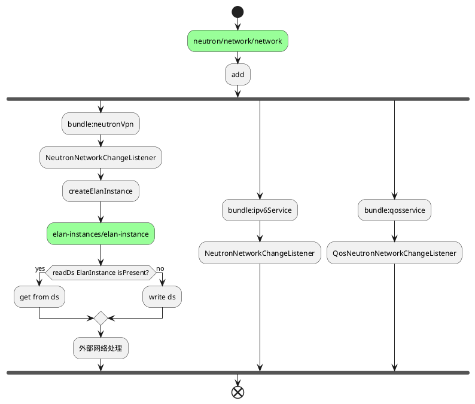
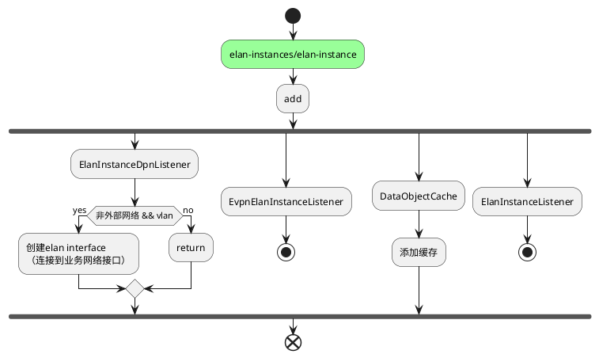
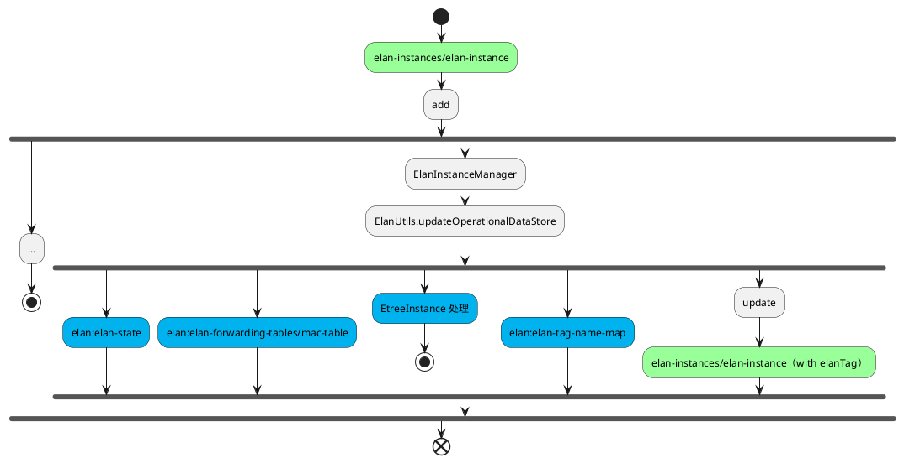
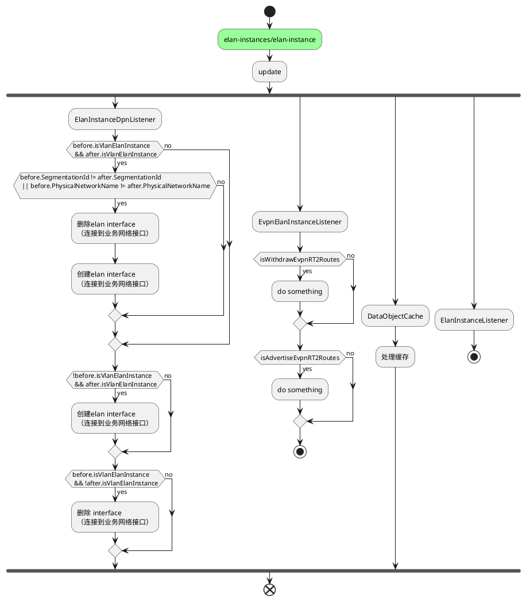
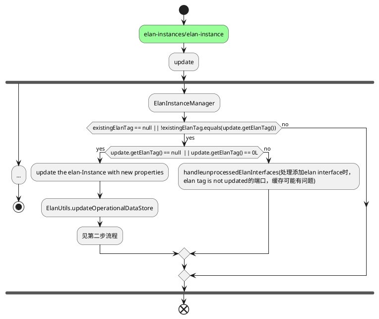
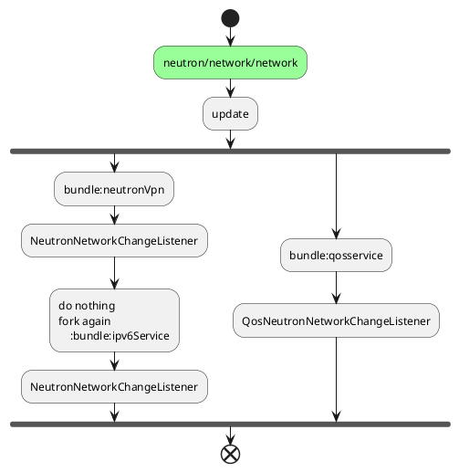
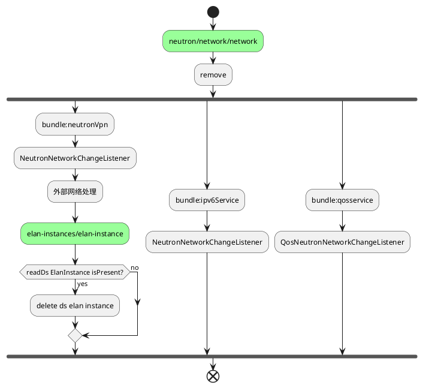

# 网络处理

## 1.add

***
<strong>
 **第一步** 
</strong>

&emsp;&emsp;当北向创建网络api被调用，neutron写入config neutron/network/network库，并触发datastore监听。

* **neutronVpn/NeutronNetworkChangeListener:** 在进行一些基础检查后，创建elanInstance（一个网络对应一个elan instance）。创建elanInstance时会查询config elan-instances/elan-instance库，如果存在，则返回，如果不存在则创建enlanInstace数据，写入config库
  
   

* **ipv6Service/NeutronNetworkChangeListener:**
 
 
  
* **qosservice/QosNeutronNetworkChangeListener:**
  
 

***

<strong>
 **第二步** 
</strong>

&emsp;&emsp;当elan-instances/elan-instance config库被写入数据后，开始触发elan创建的流程。在创建elan的过程中，会写入其他的多个operational数据库，不过这些数据库都没有监听器，仅仅作为数据存储所用。
&emsp;&emsp;创建elan-instances/elan-instance时还会更新elan-instances/elan-instance config库

&emsp;&emsp;**接下图**

***
<strong>
 **第三步** 
</strong>
&emsp;&emsp;当elan-instances/elan-instance config库被更新数据后，开始触发elan更新的流程。

&emsp;&emsp;**接下图**

## 2.update

&emsp;&emsp;当北向api 更新neutron/network/network后，NeutronNetworkChangeListener不作其他操作.

## 3.remove
***
<strong>
 **第一步** 
</strong>

    
&emsp;&emsp;删除数据库中的elan instance数据后，触发相关的其他流程。