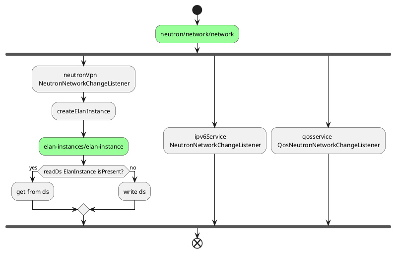
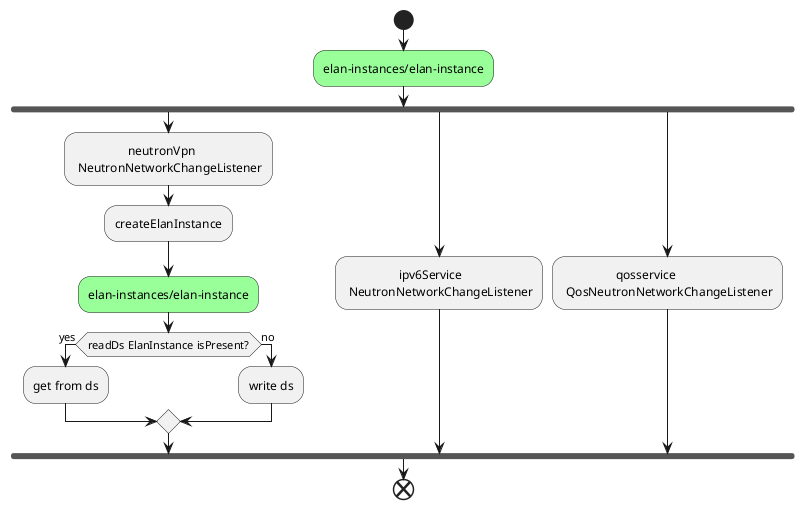

# 网络处理

## add

***
<strong><center> **第一步** </center></strong>

&emsp;&emsp;当北向创建网络api被调用，neutron写入config neutron/network/network库，并触发datastore监听。

* **neutronVpn/NeutronNetworkChangeListener:** 在进行一些基础检查后，创建elanInstance（一个网络对应一个elan instance）。创建elanInstance时会查询config elan-instances/elan-instance库，如果存在，则返回，如果不存在则创建enlanInstace数据，写入config库
  
<br/>  

* **ipv6Service/NeutronNetworkChangeListener:**
 
<br/>
  
* **qosservice/QosNeutronNetworkChangeListener:**
  
<br/>
  



`

**node1**
```
Create ietf-interfaces based on the ELAN segment type.
    For segment type flat - create transparent interface pointing to thepatch-port attached to the physnet port.<br>
    For segment type vlan - create trunk interface pointing to the patch-portattached to the physnet port + trunk-member interface pointing to thetrunk interface.
```

**node2**
```
使用非集群监听，并通过 ConcurrentMap<Uuid, Network> 缓存数据，若A为master时，创建网络并缓存，一旦集群震荡，B切换为master，此时删除网络，则A中ConcurrentMap会产生数据残留，
不清楚是否会影响业务，但是肯定会造成内存泄漏。
是否可以使用集群监听，所有节点均对缓存进行操作，但是仅仅只有owner处理业务逻辑EntityOwnershipUtils
```

***
<strong><center> **第二步** </center></strong>



`