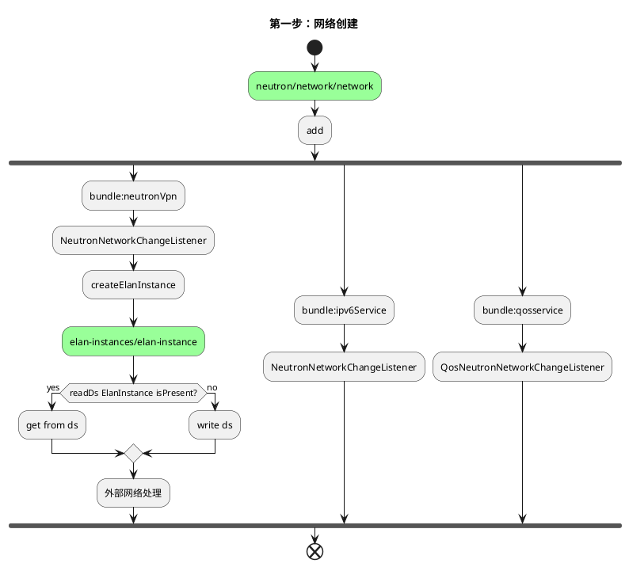
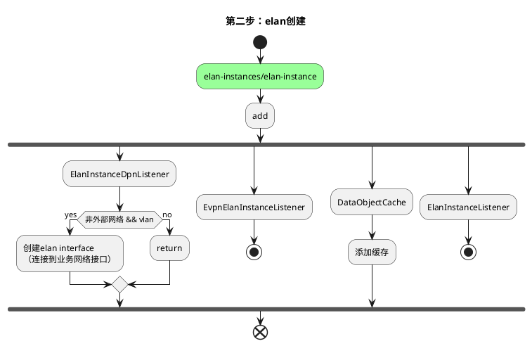

## 1. 常规步骤
### 1.1. add


***
<p style="text-align: center;"><Strong>第一步：添加网络</Strong></p>

当北向创建网络api被调用，neutron写入config neutron/network/network库，并触发datastore监听。

* neutronVpn/NeutronNetworkChangeListener：在进行一些基础检查后，创建elanInstance（一个网络对应一个elan instance）。创建elanInstance时会查询config elan-instances/elan-instance库，如果存在，则返回，如果不存在则创建enlanInstace数据，写入config库<br/><br/>

* ipv6Service/NeutronNetworkChangeListener：ipv6相关，暂不考虑<br/><br/>
 
  
* qosservice/QosNeutronNetworkChangeListener：qos相关，暂不考虑<br/><br/>

 
<!--第一步：网络创建。-->
<details>
 <summary>第一步：网络创建</summary>


</details>


***

<p style="text-align: center;"><Strong>第二步：创建elan</Strong></p>

&emsp;&emsp;当elan-instances/elan-instance config库被写入数据后，开始触发elan创建的流程。在创建elan的过程中，会写入其他的多个operational数据库，不过这些数据库都没有监听器，仅仅作为数据存储所用。
&emsp;&emsp;创建elan-instances/elan-instance时还会更新elan-instances/elan-instance config库

<!--第二步：创建elan-->
<details>
 <summary>第二步：elan创建</summary>


</details>

<!--续-->
<details>
 <summary>第二步：elan创建续</summary>

 ```plantuml
 @startuml
 title 第二步：elan创建续
 start
     #99FF99:elan-instances/elan-instance;
     :add; 
     fork
         :...;
         stop  
     fork again
         :ElanInstanceManager;
         :ElanUtils.updateOperationalDataStore;
         fork
         #00B2EE:elan:elan-state;
         fork again
         #00B2EE:elan:elan-forwarding-tables/mac-table;
         fork again
         #00B2EE:EtreeInstance 处理;
         stop;
         fork again
         #00B2EE:elan:elan-tag-name-map;
         fork again
         :update;
         #99FF99:elan-instances/elan-instance（with elanTag）; 
         end fork     
     end fork
    
 end
 
 @enduml
 ```
</details>


                                                                    

***
<p style="text-align: center;"><Strong>第三步：elan 更新</Strong></p>

&emsp;&emsp;当elan-instances/elan-instance config库被更新数据后，开始触发elan更新的流程。

<!--第三步：elan更新-->
<details>
 <summary>第三步：elan更新</summary>
 
 ```plantuml
 @startuml
 title 第三步：elan 更新
 start
     #99FF99:elan-instances/elan-instance;
     :update; 
     fork
         :ElanInstanceDpnListener; 
         if (before.isVlanElanInstance \n && after.isVlanElanInstance) then (yes)
             if (before.SegmentationId != after.SegmentationId\n || before.PhysicalNetworkName !=  after.PhysicalNetworkName\n) then (yes)    
             :删除elan interface \n（连接到业务网络接口）; 
             :创建elan interface \n（连接到业务网络接口）;
             else(no) 
             endif 
         else(no) 
         endif
 
         if (!before.isVlanElanInstance \n && after.isVlanElanInstance) then (yes)
             :创建elan interface \n（连接到业务网络接口）;
         else(no) 
         endif
 
         if (before.isVlanElanInstance \n && !after.isVlanElanInstance) then (yes)
             :删除 interface \n（连接到业务网络接口）;
         else(no) 
         endif
 
     fork again
         :EvpnElanInstanceListener;
         if (isWithdrawEvpnRT2Routes) then (yes)
             :do something;
         else(no)
         endif
         if (isAdvertiseEvpnRT2Routes) then (yes)
             :do something;
         else(no)
         endif
         stop;
     fork again
         :DataObjectCache;
         :处理缓存;
     fork again
         :ElanInstanceListener;
         stop;  
     end fork
     
 end
 
 @enduml
 
 ```
</details>

<details>
 <summary>第三步：elan 更新续</summary>

 ```plantuml
 @startuml
 title 第三步：elan 更新续
 start
     #99FF99:elan-instances/elan-instance;
     :update; 
     fork
         :...;
         stop  
     fork again
         :ElanInstanceManager;
         if (existingElanTag == null || !existingElanTag.equals(update.getElanTag()))then(yes) 
            if (update.getElanTag() == null || update.getElanTag() == 0L)then(yes)                    
                 :update the elan-Instance with new properties;
                 :ElanUtils.updateOperationalDataStore;
                 :见第二步流程;
             else(no)
                 :handleunprocessedElanInterfaces(处理添加elan interface时，\nelan tag is not updated的端口，缓存可能有问题);
             endif
         else(no)
         endif
     end fork
    
 end
 
 @enduml
 ```
</details>


### 1.2. update

&emsp;&emsp;当北向api 更新neutron/network/network后，NeutronNetworkChangeListener不作其他操作.

<details>
 <summary>网络更新</summary>
 
 ```plantuml
 @startuml
 title 网络更新
 start
     #99FF99:neutron/network/network;
     :update; 
     fork
         :bundle:neutronVpn; 
         :NeutronNetworkChangeListener;
         :do nothing;
     fork again
         :bundle:ipv6Service;
         :NeutronNetworkChangeListener;
     fork again
         :bundle:qosservice;
         :QosNeutronNetworkChangeListener;
     end fork
     
 end
 
 @enduml
 
 ```
</details>


### 1.3. remove
***
<p style="text-align: center;"><Strong>第一步：删除网络</Strong></p>
&emsp;&emsp;删除数据库中的elan instance数据后，触发相关的其他流程。

<details>
 <summary>网络删除</summary>

 ```plantuml
 @startuml
 title 网络删除
 start
     #99FF99:neutron/network/network;
     :remove; 
     fork
         :bundle:neutronVpn; 
         :NeutronNetworkChangeListener;
         :外部网络处理;
         #99FF99:elan-instances/elan-instance;
         if (readDs ElanInstance isPresent?) then (yes)
              #99FF99:delete ds elan instance; 
         else (no)
         endif
     fork again
         :bundle:ipv6Service;
         :NeutronNetworkChangeListener;
     fork again
         :bundle:qosservice;
         :QosNeutronNetworkChangeListener;
     end fork
     
 end

 @enduml

 ```
</details>


***
<p style="text-align: center;"><Strong>第二步：elan删除</Strong></p>


## 2. vlan网络创建
&emsp;&emsp;vlan 网络创建时，会提前创建一个elan interface 到业务口的映射。（odl原生代码中没有）在软件vtep 环境下创建vlan 网络或者硬件vtep环境下创建网络（overlay会将openstack创建的vxlan网络修改为vlan网络）会被触发。

<p style="text-align: center;"><Strong>第一步：vlan 网络创建</Strong></p>

<details>
 <summary>vlan网络创建</summary>
 
 ```plantuml
 @startuml
 title vlan网络创建
 participant elan_ds as elan_ds #99FF99
 
 elan_ds -> ElanInstanceDpnListener:通知
 note left
 datastore
 elan-instances/elan-instance
 end note
 
 ElanInstanceDpnListener -> ElanInstanceDpnListener:add
 activate ElanInstanceDpnListener
 alt (外部网络 || ！vlan)
     ElanInstanceDpnListener -> elan_ds:return
 end
 
 note left
 只有内部vlan网络才触发接下来的流程
 end note
 
 loop node in topo
     ElanInstanceDpnListener -> ElanServiceProvider:createExternalElanNetwork
     note right
         借用外部网络逻辑创建elan 接口
     end note
     alt (数据库不存在此elan interface)
         ElanInstanceDpnListener -> ElanServiceProvider:createExternalElanNetwork
         ElanInstanceDpnListener -> ElanServiceProvider:createIetfInterfaces
         alt (数据库不存在网络trunk 口)
             ElanInstanceDpnListener -> ElanServiceProvider:createExternalElanNetwork
             ElanInstanceDpnListener -> ElanServiceProvider:createIetfInterfaces
             ElanInstanceDpnListener ->IInterfaceManager:createVLANInterface(创建trunk口)"<font color=#43CD80><b>注意此处写  ietf-interfaces config库  "
         end
         alt (flat网络)
         IInterfaceManager -> ElanInstanceDpnListener:return trunkName
         note right
             扁平网络特性
         end note
         else not
             ElanInstanceDpnListener ->IInterfaceManager:createVLANInterface(创建elan口)"<font color=#43CD80><b>注意此处写  ietf-interfaces config库  "
         end
     end
 end
 
 ElanServiceProvider -> ElanServiceProvider:addElanInterface（只添加elan interface）
 ElanServiceProvider -> elan_ds:写入elan interface"<font color=#43CD80><b>注意此处写 elan interface config库  "
 deactivate ElanInstanceDpnListener
 
 @enduml
 
 ```
</details>

&emsp;&emsp;在上图中，有几处会写数据库的操作，因此，会触发其他监听程序。

&emsp;&emsp;上图中trunk 口可elan interface的解释如下。其中`IfmConstants.OF_URI_SEPARATOR=":"`；`parentRef = dpnid:业务口`

|    端口性质     |                          名称规则                          |             示例             |
| --------------- | ---------------------------------------------------------- | ---------------------------- |
| trunk           | parentRef + IfmConstants.OF_URI_SEPARATOR + "trunk"        | 203100663178074:ens192:trunk |
| elan interfaced | parentRef + IfmConstants.OF_URI_SEPARATOR + segmentationId | 62457717962162:ens192:100    |


***
<p style="text-align: center;"><Strong>第二步：ietf interface 创建</Strong></p>

<details>
 <summary>ietf interface创建</summary>

 ```plantuml
 @startuml
 title ietf interface创建
 start
     #99FF99:interfaces/interface/interface;
     :add; 
     fork
         :ElanInterfaceConfigListener\nAclInterfaceListener\nHwVTEPConfigListener;
         stop
     fork again
         :InterfaceConfigListener;
         :ovsInterfaceConfigAddHelper/n.addConfiguration(parentRefs, interfaceNew);
         :interfaceManagerCommonUtils.addStateEntry;
         note left
             只处理trunk 口；
             与父接口的state
             一致
         end note
         #00B2EE:operational/ietf-interfaces:interfaces-state;
         #EE3B3B:install ingress flow;
         #00B2EE:Update the DpnToInterfaceList OpDS;
 
     fork again
         :VlanMemberConfigListener;
         :addVlanMember(newInterface);
         note left
             只处理elan 口
         end note
         :ovsVlanMemberConfigAddHelper.\n addConfiguration(parentRefs, added);
         note left
             回调处理，当父接口
             的Op state 库
             有添加或更新时触发
         end note
         :interfaceManagerCommonUtils.addStateEntry;
         note left
             与父接口的state
             一致
         end note
         #00B2EE:operational/ietf-interfaces:interfaces-state;
         #EE3B3B:install ingress flow;
         #00B2EE:Update the DpnToInterfaceList OpDS;
     end fork
         
 end
 
 @enduml
 
 ```
</details>

***
<p style="text-align: center;"><Strong>第三步：elan interface 创建</Strong></p>


<details>
 <summary>elan interface创建</summary>

 ```plantuml
 @startuml
 title elan interface创建
 start
     #99FF99:elan-interfaces/elan-interface/elan-interface;
     :add; 
     fork
         :VpnElanInterfaceChangeListener;
         note left
             只针对外部网
             络的接口处理
         end note
         stop
     fork again
         :AclElanInterfaceListener;
         stop
     fork again
         :DataObjectCache;
         :缓存处理;
     fork again
         :ElanInterfaceManager;
         note left 
             关键逻辑
         end note
         :接下图;
     end fork
         
 end
 
 @enduml

 ```
</details>

***
<p style="text-align: center;"><Strong>第三步续：elan interface 创建</Strong></p>


<details>
 <summary>elan interface创建续</summary>

 ```plantuml
 @startuml
 title vlan网络创建
 ElanInterfaceManager ->ElanInterfaceManager:add
 activate ElanInterfaceManager #8B8989
 activate ElanInterfaceManager
 alt elanInstance not exit
     ElanInterfaceManager ->ElanUtils:updateOperationalDataStore(elanInstance)
 end
 
 alt  elan tag is not updated
     ElanInterfaceManager->ElanInterfaceManager:unProcessedElanInterfaces.put(elanInstanceName, elanInterfaces);
     ElanInterfaceManager->ElanInterfaceManager:return void
 end
 deactivate ElanInterfaceManager
 ElanInterfaceManager->InterfaceAddWorkerOnElan:call(队列执行)
 InterfaceAddWorkerOnElan -> ElanInterfaceManager:addElanInterface
 alt elanInfo==null
 ElanInterfaceManager -> ElanUtils:updateOperationalDataStore(idManager, elanInstance, elanInterfaces, tx) "<font   color=#00B2EE><b> 更新操作库
 else  
 ElanInterfaceManager -> ElanInterfaceManager:createElanStateList(elanInstanceName, interfaceName, tx) "<font   color=#00B2EE><b> 更新操作库 elan:elan-state
 end
 
 alt dpId != null && !dpId.equals(ElanConstants.INVALID_DPN
     alt isFirstInterfaceInDpn
         alt isVxlanNetworkOrVxlanSegment(elanInstance)
             ElanInterfaceManager -> ElanInterfaceManager:setExternalTunnelTable "<font color=#EE3B3B><b> table 38 流表相  关；The 1st ElanInterface in a \n <font color=#EE3B3B><b> DPN must program the Ext Tunnel table, but only if   Elan has VNI     
         end
         ElanInterfaceManager -> ElanL2GatewayUtils:installElanL2gwDevicesLocalMacsInDpn "<font color=#EE3B3B><b> table 51   流表相关
     else
         ElanInterfaceManager -> ElanL2GatewayUtils:installElanL2gwDevicesLocalMacsInDpn "<font color=#EE3B3B><b> table 51   流表相关
         ElanInterfaceManager ->ElanInterfaceManager:updateElanDpnInterfacesList  "<font color=#00B2EE><b> 更新操作库   elan:elan-dpn-interfaces
     end
 end
 ElanInterfaceManager ->ElanInterfaceManager:createElanInterfaceTablesList"<font color=#00B2EE><b> 更新操作库   elan:elan-interface-forwarding-entries
 ElanInterfaceManager ->ElanInterfaceManager:installEntriesForFirstInterfaceonDpn
 ElanInterfaceManager ->ElanInterfaceManager:setupStandardLocalBroadcastGroups "<font color=#EE3B3B><b> group local 相关
 ElanInterfaceManager ->ElanInterfaceManager:setupLeavesLocalBroadcastGroups"<font color=#EE3B3B><b> group local 相关，   etree 网络模型
 
 alt ElanUtils.isVlan(elanInstance) && !elanInstance.isExternal()
     alt interfaceManager.isExternalInterface(interfaceName)
         ElanInterfaceManager ->ElanInterfaceManager:handleExternalInterfaceEvent
         ElanInterfaceManager ->ElanL2GatewayMulticastUtils:setupStandardElanBroadcastGroups"<font color=#EE3B3B><b> group   remote 相关， etree 网络模型
     end
 end
 alt isFirstInterfaceInDpn && isVxlanNetworkOrVxlanSegment(elanInstance)
     ElanInterfaceManager ->ElanInterfaceManager:setElanAndEtreeBCGrouponOtherDpns(elanInstance, dpId)
     note left
         还有一些逻辑
     end note
 end
 
 ElanInterfaceManager ->InterfaceAddWorkerOnElanInterface:caLL
 ElanInterfaceManager ->ElanInterfaceManager:setupEntriesForElanInterface
 ElanInterfaceManager ->ElanInterfaceManager:installEntriesForElanInterface
 ElanInterfaceManager ->ElanInterfaceManager:setupFilterEqualsTable"<font color=#EE3B3B><b> table 55 相关
 
 alt isFirstInterfaceInDpn
     alt (isVxlanNetworkOrVxlanSegment(elanInstance)) 
         ElanInterfaceManager ->ElanInterfaceManager:setupTerminateServiceTable "<font color=#EE3B3B><b> table 36 相关          
     end
     ElanInterfaceManager ->ElanInterfaceManager:setupUnknownDMacTable"<font color=#EE3B3B><b> table 52 相关
     alt !interfaceManager.isExternalInterface
         ElanInterfaceManager ->ElanInterfaceManager:programRemoteDmacFlow"<font color=#EE3B3B><b> table 51 相关
     end
 end
 ElanInterfaceManager ->ElanInterfaceManager:bindService"<font color=#EE3B3B><b> table 17 /220 相关
 deactivate ElanInterfaceManager
 
 
 @enduml
 
 ```
</details>

<details>
 <summary>创建vlan 网络 下发流表示例</summary>
 
 ```text
 table=0, priority=4,in_port=3,vlan_tci=0x0000/0x1fff actions=write_metadata:0x90000000001/0xffffff0000000001,goto_table:17
 table=0, priority=10,in_port=3,dl_vlan=10 actions=pop_vlan,write_metadata:0xa0000000001/0xffffff0000000001,goto_table:17
 table=17, priority=10,metadata=0xa0000000000/0xffffff0000000000 actions=load:0xa->NXM_NX_REG1[0..19], load:0x138a->NXM_NX_REG7[0..15],write_metadata:0xa0000a138a000000/0xfffffffffffffffe,goto_table:43
 table=52, priority=5,metadata=0x138a000000/0xffff000001 actions=write_actions(group:210004)
 table=52, priority=5,metadata=0x138a000001/0xffff000001 actions=write_actions(group:210003)
 table=55, priority=10,tun_id=0xa,metadata=0xa0000000000/0xfffff0000000000 actions=drop
 table=55, priority=9,tun_id=0xa actions=load:0xa00->NXM_NX_REG6[],resubmit(,220)
 table=220, priority=10,reg6=0x900,metadata=0x1/0x1 actions=drop
 table=220, priority=10,reg6=0xa00,metadata=0x1/0x1 actions=drop
 table=220, priority=9,reg6=0x900 actions=output:3
 table=220, priority=9,reg6=0xa00 actions=push_vlan:0x8100,set_field:4106->vlan_vid,output:3
 ```
 ```text
 group_id=210003,type=all
 group_id=210004,type=all,bucket=actions=group:210003,bucket=actions=load:0xa00->NXM_NX_REG6[],resubmit(,220)
 ```

</details>
