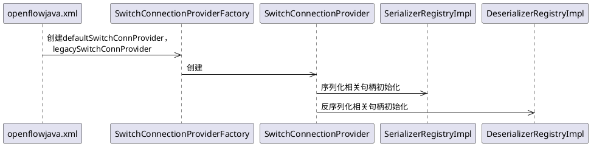
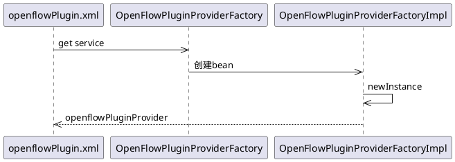
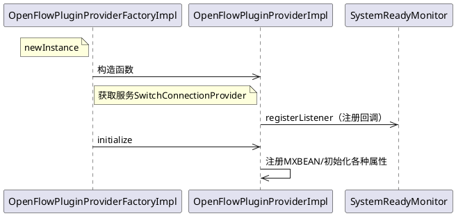
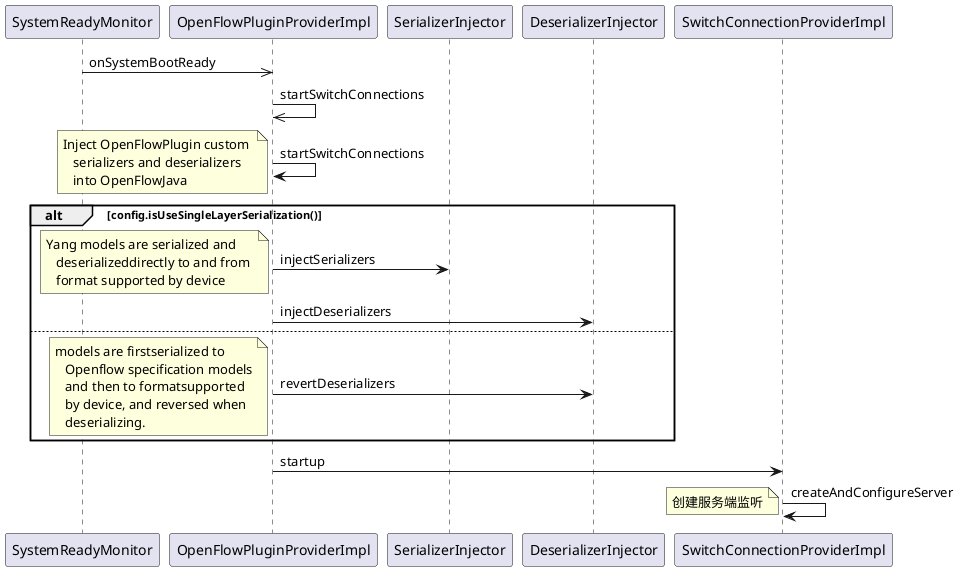

## 1.SwitchConnectionProvider初始化
&emsp;&emsp;SwitchConnectionProvider包含两种类型：defaultSwitchConnProvider对应openflow13，监听6653端口；legacySwitchConnProvider对应openflow10，监听6633端口。两者均会被初始化，初始化时，会创建序列化和反序列化的相关句柄。



## 2.openflowPluginProvider创建
&emsp;&emsp;openflowPluginProvider为openflow对外服务的接口入口，包含了rpc，notification，databroker，entityOwnershipService等关键信息。
&emsp;&emsp;defaultSwitchConnProvider，legacySwitchConnProvider分别对应openflow13和openflow10。版本不同，后续netty pipeline中添加的handle不同。

图：openflowPluginProvider创建



具体代码如下：

```text
<bean id="openflowPluginProvider"
    factory-ref="openflowPluginProviderFactory"
    factory-method="newInstance"
    destroy-method="close">
    <argument ref="configurationService"/>
    <argument ref="dataBroker"/>
    <argument ref="rpcRegistry"/>
    <argument ref="notificationPublishService"/>
    <argument ref="entityOwnershipService"/>
    <argument>
        <list>
            <ref component-id="defaultSwitchConnProvider"/>
            <ref component-id="legacySwitchConnProvider"/>
        </list>
    </argument>
    <argument ref="clusterSingletonServiceProvider"/>
    <argument ref="mastershipChangeServiceManager"/>
    <argument ref="ofPluginDiagstatusProvider"/>
    <argument ref="systemReadyMonitor"/>
</bean>
```

## 3.OpenFlowPluginProviderImpl初始化
&emsp;&emsp;`OpenFlowPluginProviderFactoryImpl newInstance`中会调用`OpenFlowPluginProviderImpl`的构建函数，而`OpenFlowPluginProviderImpl`的构建函数中的`systemReadyMonitor.registerListener(this)`会监听osgi是否所有bundle已经安装，其后会回调函数`onSystemBootReady`。
&emsp;&emsp;同时`OpenFlowPluginProviderFactoryImpl newInstance`会调用`OpenFlowPluginProviderImpl;initialize`进行一些初始化工作。注意，这里注册了MXBEAN，我们可以在外部通过jmx监控内部信息。
&emsp;&emsp;OpenFlowPluginProviderImpl会通过blueprint获取SwitchConnectionProvider服务。
图：OpenFlowPluginProviderImpl初始化   
 


## 4.监听创建
&emsp;&emsp;当osgi所有bundle安装完成后，框架会回调onSystemBootReady函数。创建服务端监听。
图：监听创建

